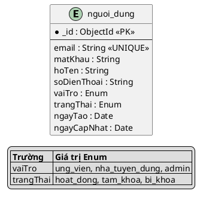
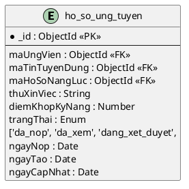

# HƯỚNG DẪN VẼ ENUM TRONG ERD
## Các cách biểu diễn Enum trong Entity Relationship Diagram

---

## PHẦN 1: CÁC CÁCH BIỂU DIỄN ENUM

### **Cách 1: Ghi đơn giản `Enum` (Đang dùng) ⭐ KHUYẾN NGHỊ**

```
gioiTinh : Enum
trangThai : Enum
```

**Ưu điểm:**
- ✅ Gọn gàng, dễ đọc
- ✅ Phù hợp khi ERD đã có bảng giải thích chi tiết
- ✅ Không làm rối ERD khi có nhiều enum

**Nhược điểm:**
- ❌ Không thấy được các giá trị enum ngay trong sơ đồ

**Khi nào dùng:** 
- ERD tổng quan
- Có tài liệu chi tiết kèm theo
- Nhiều enum trong hệ thống

---

### **Cách 2: Ghi chi tiết giá trị Enum trong ERD ⭐ KHUYẾN NGHỊ (Nếu ít enum)**

```
gioiTinh : Enum ['nam', 'nu', 'khac']
trangThai : Enum ['hoat_dong', 'tam_khoa', 'bi_khoa']
vaiTro : Enum ['ung_vien', 'nha_tuyen_dung', 'admin']
```

**Ưu điểm:**
- ✅ Thấy rõ giá trị enum ngay trong ERD
- ✅ Không cần tra tài liệu bên ngoài
- ✅ Phù hợp cho enum ngắn (2-4 giá trị)

**Nhược điểm:**
- ❌ Làm rối ERD nếu enum có nhiều giá trị (>5)
- ❌ Chiếm nhiều không gian

**Khi nào dùng:**
- ERD chi tiết
- Enum có ít giá trị (2-5)
- Cần hiển thị đầy đủ thông tin

---

### **Cách 3: Dùng kiểu dữ liệu VARCHAR/String với constraint**

```
gioiTinh : String
  CHECK IN ('nam', 'nu', 'khac')
  
trangThai : VARCHAR(20)
  CHECK IN ('hoat_dong', 'tam_khoa', 'bi_khoa')
```

**Ưu điểm:**
- ✅ Chuẩn SQL, gần với database thực tế
- ✅ Rõ ràng về kiểu lưu trữ

**Nhược điểm:**
- ❌ Dài dòng
- ❌ Không phù hợp với MongoDB

**Khi nào dùng:**
- Database quan hệ (MySQL, PostgreSQL)
- ERD implementation chi tiết

---

### **Cách 4: Tạo bảng Enum riêng (Lookup Table)**

```
[nguoi_dung]
vaiTro : ObjectId <<FK>>

[danh_muc_vai_tro]
_id : ObjectId <<PK>>
maVaiTro : String (UNIQUE)
tenVaiTro : String
```

**Ưu điểm:**
- ✅ Linh hoạt, dễ thêm giá trị mới
- ✅ Có thể thêm metadata (mô tả, icon, màu sắc)
- ✅ Dễ quốc tế hóa (i18n)

**Nhược điểm:**
- ❌ Tăng số bảng
- ❌ Cần JOIN khi query
- ❌ Phức tạp cho enum đơn giản

**Khi nào dùng:**
- Enum có thể thay đổi thường xuyên
- Cần metadata cho enum
- Hệ thống đa ngôn ngữ

---

## PHẦN 2: KHUYẾN NGHỊ CHO HỆ THỐNG CỦA BẠN

### **MongoDB/Mongoose - Nên dùng cách nào?**

#### ✅ **KHUYẾN NGHỊ: Kết hợp Cách 1 và Cách 2**

**Trong ERD tổng quan:** Dùng `Enum` đơn giản
```
entity "nguoi_dung" as NguoiDung {
  * _id : ObjectId <<PK>>
  --
  email : String
  matKhau : String
  hoTen : String
  vaiTro : Enum
  trangThai : Enum
  ngayTao : Date
}
```

**Trong bảng chi tiết hoặc legend:** Liệt kê giá trị
```
legend right
  |= Trường |= Enum Values |
  | vaiTro | ung_vien, nha_tuyen_dung, admin |
  | trangThai | hoat_dong, tam_khoa, bi_khoa |
endlegend
```

Hoặc:

**Trong ERD chi tiết từng bảng:** Ghi đầy đủ
```
entity "nguoi_dung" as NguoiDung {
  * _id : ObjectId <<PK>>
  --
  email : String <<UNIQUE>>
  matKhau : String
  hoTen : String
  vaiTro : Enum ['ung_vien', 'nha_tuyen_dung', 'admin']
  trangThai : Enum ['hoat_dong', 'tam_khoa', 'bi_khoa']
  ngayTao : Date
}
```

---

## PHẦN 3: ÁP DỤNG CHO HỆ THỐNG EFFORTIT

### **Tất cả Enum trong hệ thống:**

#### 1. **nguoi_dung**
```typescript
vaiTro : Enum ['ung_vien', 'nha_tuyen_dung', 'admin']
trangThai : Enum ['hoat_dong', 'tam_khoa', 'bi_khoa']
```

#### 2. **ung_vien**
```typescript
gioiTinh : Enum ['nam', 'nu', 'khac']
```

#### 3. **nha_tuyen_dung**
```typescript
trangThaiDuyet : Enum ['cho_duyet', 'da_duyet', 'tu_choi', 'bi_khoa']
```

#### 4. **tin_tuyen_dung**
```typescript
loaiHinh : Enum ['toan_thoi_gian', 'ban_thoi_gian', 'thuc_tap', 'tu_xa', 'hybrid']
capBac : Enum ['intern', 'fresher', 'junior', 'middle', 'senior', 'lead']
trangThai : Enum ['nhap', 'cho_duyet', 'dang_mo', 'tam_dong', 'het_han', 'tu_choi']
```

#### 5. **ho_so_nang_luc**
```typescript
loaiHoSo : Enum ['builder', 'file_upload']
fileCvTextStatus : Enum ['pending', 'processing', 'completed', 'failed']
```

#### 6. **ho_so_ung_tuyen**
```typescript
trangThai : Enum ['da_nop', 'da_xem', 'dang_xet_duyet', 'moi_phong_van', 'dat', 'tu_choi', 'da_rut']
```

#### 7. **lich_phong_van**
```typescript
hinhThuc : Enum ['online', 'offline']
trangThai : Enum ['da_len_lich', 'da_xac_nhan', 'doi_lich', 'hoan_thanh', 'da_huy']
ketQua : Enum ['cho_ket_qua', 'dat', 'khong_dat']
```

#### 8. **thong_bao**
```typescript
loai : Enum ['he_thong', 'ho_so_ung_tuyen', 'lich_phong_van', 'tin_tuyen_dung', 
             'cong_ty', 'tin_nhan', 'ket_qua_phong_van']
mucDoUuTien : Enum ['thap', 'trung_binh', 'cao', 'khan_cap']
```

#### 9. **cuoc_tro_chuyen**
```typescript
loai : Enum ['ung_vien_nha_tuyen_dung', 'admin_support', 'nhom_cong_dong']
```

#### 10. **tin_nhan**
```typescript
loai : Enum ['text', 'file', 'image', 'system']
```

#### 11. **goi_y_viec_lam**
```typescript
trangThai : Enum ['dang_chay', 'hoan_thanh', 'loi']
```

---

## PHẦN 4: VÍ DỤ VẼ ERD CHUẨN

### **Ví dụ 1: ERD tổng quan (Dùng Enum đơn giản)**



---

### **Ví dụ 2: ERD chi tiết (Ghi đầy đủ Enum)**



---

### **Ví dụ 3: Enum trong bảng mô tả dữ liệu (Markdown)**

| Tên trường | Kiểu dữ liệu | Enum Values | Mô tả |
|------------|--------------|-------------|-------|
| `vaiTro` | Enum | `ung_vien`, `nha_tuyen_dung`, `admin` | Vai trò tài khoản |
| `trangThai` | Enum | `hoat_dong`, `tam_khoa`, `bi_khoa` | Trạng thái tài khoản |

---

## PHẦN 5: LỰA CHỌN CUỐI CÙNG CHO HỆ THỐNG CỦA BẠN

### ✅ **KHUYẾN NGHỊ: Cách tiếp cận 3 tầng**

#### **Tầng 1: ERD Tổng quan (PlantUML)**
- Dùng `Enum` đơn giản để ERD gọn gàng
- Thêm legend cho các enum quan trọng

```
gioiTinh : Enum
trangThai : Enum
vaiTro : Enum
```

#### **Tầng 2: Bảng chi tiết dữ liệu (Markdown)**
- Liệt kê đầy đủ giá trị enum
- Giải thích ý nghĩa từng giá trị

```markdown
| vaiTro | Enum | ung_vien, nha_tuyen_dung, admin | Vai trò người dùng |
```

#### **Tầng 3: Code implementation (TypeScript)**
- Export enum constants
- Dùng trong Mongoose schema

```typescript
export const vaiTroNguoiDung = ['ung_vien', 'nha_tuyen_dung', 'admin'] as const
```

---

## KẾT LUẬN

**Cho MongoDB/Mongoose như hệ thống của bạn:**

### ✅ Trong ERD PlantUML:
```
trangThai : Enum
```
Hoặc nếu muốn chi tiết:
```
trangThai : Enum ['hoat_dong', 'tam_khoa', 'bi_khoa']
```

### ✅ Trong bảng mô tả:
```markdown
| trangThai | Enum | hoat_dong, tam_khoa, bi_khoa | Trạng thái tài khoản |
```

### ✅ Trong code:
```typescript
trangThai: { type: String, enum: ['hoat_dong', 'tam_khoa', 'bi_khoa'] }
```

**KHÔNG DÙNG:** `INT`, `TINYINT`, `VARCHAR` - Đây là cách của SQL, không phù hợp MongoDB.
