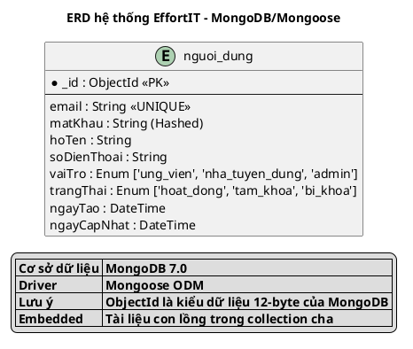

# SO SÁNH KIỂU DỮ LIỆU: MySQL vs MongoDB vs ERD Tổng Quát
## Áp dụng cho hệ thống EffortIT

---

## CÂU HỎI:

**"Bình thường MySQL dùng kiểu dữ liệu thế này, còn nếu không phải MySQL và MongoDB thì sao? Tất cả các bảng này sau đó thành cái gì?"**

---

## PHẦN 1: BẢNG SO SÁNH TỔNG QUAN

### **1.1. Kiểu dữ liệu cơ bản**

| ERD Tổng quát | MySQL (SQL) | MongoDB (NoSQL) | PostgreSQL | SQL Server | Ghi chú |
|---------------|-------------|-----------------|------------|------------|---------|
| **String** | VARCHAR(n) | String | VARCHAR(n) | NVARCHAR(n) | Chuỗi có độ dài |
| **Text** | TEXT / LONGTEXT | String | TEXT | TEXT | Văn bản dài |
| **Int** | INT / INTEGER | Number (Int32) | INTEGER | INT | Số nguyên 32-bit |
| **BigInt** | BIGINT | Number (Int64) | BIGINT | BIGINT | Số nguyên 64-bit |
| **TinyInt** | TINYINT | Number | SMALLINT | TINYINT | Số nguyên nhỏ (0-255) |
| **Float** | FLOAT | Number (Double) | REAL | FLOAT | Số thực độ chính xác đơn |
| **Double** | DOUBLE | Number (Double) | DOUBLE PRECISION | FLOAT(53) | Số thực độ chính xác kép |
| **Decimal** | DECIMAL(p,s) | Number (Decimal128) | NUMERIC(p,s) | DECIMAL(p,s) | Số thập phân chính xác |
| **Boolean** | BOOLEAN / TINYINT(1) | Boolean | BOOLEAN | BIT | True/False |
| **Date** | DATE | Date (ISODate) | DATE | DATE | Chỉ ngày (YYYY-MM-DD) |
| **DateTime** | DATETIME | Date (ISODate) | TIMESTAMP | DATETIME2 | Ngày + giờ |
| **Timestamp** | TIMESTAMP | Date (ISODate) | TIMESTAMP | DATETIME2 | Tự động cập nhật |
| **ObjectId** | - (VARCHAR hoặc BINARY) | ObjectId | UUID | UNIQUEIDENTIFIER | ID duy nhất MongoDB |
| **JSON** | JSON | Object / Mixed | JSONB | NVARCHAR(MAX) | Dữ liệu JSON |
| **Array** | - (Cần bảng liên kết) | Array | ARRAY | - (Cần bảng liên kết) | Mảng giá trị |
| **Binary** | BLOB / VARBINARY | Buffer / BinData | BYTEA | VARBINARY(MAX) | Dữ liệu nhị phân |
| **Enum** | ENUM('a','b','c') | String + validate | Custom TYPE | - (CHECK constraint) | Tập giá trị cố định |

---

## PHẦN 2: KHÁI NIỆM "BẢNG" TRONG CÁC HỆ THỐNG

### **2.1. Thuật ngữ khác nhau**

| ERD / Khái niệm | MySQL | MongoDB | PostgreSQL | Cassandra | Firebase | DynamoDB |
|-----------------|-------|---------|------------|-----------|----------|----------|
| **Bảng / Table** | Table | Collection | Table | Column Family | Collection | Table |
| **Dòng / Record** | Row | Document | Row | Row | Document | Item |
| **Cột / Field** | Column | Field | Column | Column | Field | Attribute |
| **Khóa chính** | PRIMARY KEY | _id (ObjectId) | PRIMARY KEY | PRIMARY KEY | Document ID | Partition Key |
| **Khóa ngoại** | FOREIGN KEY + REFERENCES | ObjectId + ref | FOREIGN KEY | - (Denormalize) | Reference | - (Denormalize) |
| **Index** | INDEX | Index | INDEX | Secondary Index | Index | Global Secondary Index |

### **2.2. Ví dụ cụ thể: Bảng NGUOIDUNG**

#### **MySQL (SQL - Relational):**
```sql
CREATE TABLE nguoi_dung (
  id INT AUTO_INCREMENT PRIMARY KEY,
  email VARCHAR(255) UNIQUE NOT NULL,
  mat_khau VARCHAR(255) NOT NULL,
  ho_ten VARCHAR(255) NOT NULL,
  so_dien_thoai VARCHAR(20),
  vai_tro ENUM('ung_vien', 'nha_tuyen_dung', 'admin') DEFAULT 'ung_vien',
  trang_thai ENUM('hoat_dong', 'tam_khoa', 'bi_khoa') DEFAULT 'hoat_dong',
  ngay_tao DATETIME DEFAULT CURRENT_TIMESTAMP,
  ngay_cap_nhat DATETIME DEFAULT CURRENT_TIMESTAMP ON UPDATE CURRENT_TIMESTAMP
);
```

#### **MongoDB (NoSQL - Document-based):**
```javascript
// Collection: nguoi_dung
{
  _id: ObjectId("507f1f77bcf86cd799439011"),
  email: "user@example.com",
  matKhau: "hashed_password",
  hoTen: "Nguyễn Văn A",
  soDienThoai: "0901234567",
  vaiTro: "ung_vien",
  trangThai: "hoat_dong",
  ngayTao: ISODate("2024-01-15T10:30:00Z"),
  ngayCapNhat: ISODate("2024-01-15T10:30:00Z")
}
```

#### **PostgreSQL (SQL - Advanced):**
```sql
CREATE TYPE vai_tro_enum AS ENUM ('ung_vien', 'nha_tuyen_dung', 'admin');
CREATE TYPE trang_thai_enum AS ENUM ('hoat_dong', 'tam_khoa', 'bi_khoa');

CREATE TABLE nguoi_dung (
  id SERIAL PRIMARY KEY,
  email VARCHAR(255) UNIQUE NOT NULL,
  mat_khau VARCHAR(255) NOT NULL,
  ho_ten VARCHAR(255) NOT NULL,
  so_dien_thoai VARCHAR(20),
  vai_tro vai_tro_enum DEFAULT 'ung_vien',
  trang_thai trang_thai_enum DEFAULT 'hoat_dong',
  ngay_tao TIMESTAMP DEFAULT NOW(),
  ngay_cap_nhat TIMESTAMP DEFAULT NOW()
);
```

---

## PHẦN 3: CHUYỂN ĐỔI HỆ THỐNG EFFORTIT

### **3.1. Nếu chuyển từ MongoDB sang MySQL**

#### **Bảng nguoi_dung**

| MongoDB Field | Mongoose Type | MySQL Column | MySQL Type | Ghi chú |
|---------------|---------------|--------------|------------|---------|
| `_id` | ObjectId | `id` | **INT AUTO_INCREMENT** | Khóa chính |
| `email` | String | `email` | **VARCHAR(255) UNIQUE** | Email duy nhất |
| `matKhau` | String | `mat_khau` | **VARCHAR(255)** | Mật khẩu đã hash |
| `hoTen` | String | `ho_ten` | **VARCHAR(255)** | Họ tên |
| `soDienThoai` | String | `so_dien_thoai` | **VARCHAR(20)** | Số điện thoại |
| `vaiTro` | Enum | `vai_tro` | **ENUM('ung_vien', 'nha_tuyen_dung', 'admin')** | Vai trò |
| `trangThai` | Enum | `trang_thai` | **ENUM('hoat_dong', 'tam_khoa', 'bi_khoa')** | Trạng thái |
| `ngayTao` | Date | `ngay_tao` | **DATETIME** | Ngày tạo |
| `ngayCapNhat` | Date | `ngay_cap_nhat` | **DATETIME** | Ngày cập nhật |

---

#### **Bảng ung_vien**

| MongoDB Field | Mongoose Type | MySQL Column | MySQL Type | Ghi chú |
|---------------|---------------|--------------|------------|---------|
| `_id` | ObjectId | `id` | **INT AUTO_INCREMENT** | Khóa chính |
| `maNguoiDung` | ObjectId (FK) | `ma_nguoi_dung` | **INT UNIQUE** | FK → nguoi_dung(id) |
| `ngaySinh` | Date | `ngay_sinh` | **DATE** | Ngày sinh |
| `gioiTinh` | Enum | `gioi_tinh` | **ENUM('nam', 'nu', 'khac')** | Giới tính |
| `diaChi` | String | `dia_chi` | **VARCHAR(500)** | Địa chỉ |
| `anhDaiDien` | String | `anh_dai_dien` | **VARCHAR(500)** | URL ảnh |
| `tomTat` | String | `tom_tat` | **TEXT** | Tóm tắt |
| `kinhNghiem` | Number | `kinh_nghiem` | **INT** | Số năm kinh nghiệm |
| `viTriMongMuon` | String | `vi_tri_mong_muon` | **VARCHAR(200)** | Vị trí mong muốn |
| `mucLuongMongMuon` | Number | `muc_luong_mong_muon` | **DECIMAL(15,2)** | Lương mong muốn (VNĐ) |
| `kyNang[]` | Embedded | **(Tách bảng)** | **ung_vien_ky_nang** | Bảng liên kết n-n |
| `portfolio[]` | Embedded | **(Tách bảng)** | **ung_vien_portfolio** | Bảng 1-n |
| `ngayTao` | Date | `ngay_tao` | **DATETIME** | Ngày tạo |

---

#### **Bảng ung_vien_ky_nang** (MongoDB embedded → MySQL separate table)

**MongoDB (Embedded):**
```javascript
kyNang: [
  { maKyNang: ObjectId("..."), mucDo: 4 },
  { maKyNang: ObjectId("..."), mucDo: 3 }
]
```

**MySQL (Separate table):**
```sql
CREATE TABLE ung_vien_ky_nang (
  id INT AUTO_INCREMENT PRIMARY KEY,
  ma_ung_vien INT NOT NULL,
  ma_ky_nang INT NOT NULL,
  muc_do TINYINT CHECK (muc_do BETWEEN 1 AND 5),
  FOREIGN KEY (ma_ung_vien) REFERENCES ung_vien(id) ON DELETE CASCADE,
  FOREIGN KEY (ma_ky_nang) REFERENCES danh_muc_ky_nang(id),
  UNIQUE (ma_ung_vien, ma_ky_nang)
);
```

---

#### **Bảng ho_so_nang_luc - Trường hợp phức tạp**

| MongoDB Field | Mongoose Type | MySQL Column | MySQL Type | Ghi chú |
|---------------|---------------|--------------|------------|---------|
| `hocVan[]` | Embedded Array | **(Tách bảng)** | **ho_so_hoc_van** | 1-n |
| `kinhNghiemLam[]` | Embedded Array | **(Tách bảng)** | **ho_so_kinh_nghiem** | 1-n |
| `kyNangLapTrinh[]` | Embedded Array | **(Tách bảng)** | **ho_so_ky_nang_lap_trinh** | 1-n |
| `duAnChiTiet[]` | Embedded Array | **(Tách bảng)** | **ho_so_du_an** | 1-n |
| `tomTatKinhNghiem[]` | String Array | `tom_tat_kinh_nghiem` | **TEXT** (JSON) | Lưu dạng JSON |
| `kyNangMem[]` | String Array | `ky_nang_mem` | **TEXT** (JSON) | Lưu dạng JSON |

**Ví dụ bảng ho_so_hoc_van (MySQL):**
```sql
CREATE TABLE ho_so_hoc_van (
  id INT AUTO_INCREMENT PRIMARY KEY,
  ma_ho_so_nang_luc INT NOT NULL,
  tieu_de VARCHAR(255),
  don_vi VARCHAR(255),
  thoi_gian VARCHAR(100),
  mo_ta TEXT,
  FOREIGN KEY (ma_ho_so_nang_luc) REFERENCES ho_so_nang_luc(id) ON DELETE CASCADE
);
```

---

#### **Bảng cuoc_tro_chuyen - Many-to-Many phức tạp**

**MongoDB:**
```javascript
{
  nguoiThamGia: [ObjectId("user1"), ObjectId("user2")],
  soChuaDoc: {
    "user1_id": 5,
    "user2_id": 0
  }
}
```

**MySQL:**
```sql
-- Bảng chính
CREATE TABLE cuoc_tro_chuyen (
  id INT AUTO_INCREMENT PRIMARY KEY,
  loai ENUM('ung_vien_nha_tuyen_dung', 'admin_support', 'nhom_cong_dong'),
  ten_nhom VARCHAR(255),
  da_luu_tru BOOLEAN DEFAULT FALSE,
  ngay_tao DATETIME
);

-- Bảng liên kết n-n
CREATE TABLE cuoc_tro_chuyen_thanh_vien (
  id INT AUTO_INCREMENT PRIMARY KEY,
  ma_cuoc_tro_chuyen INT NOT NULL,
  ma_nguoi_dung INT NOT NULL,
  so_chua_doc INT DEFAULT 0,
  FOREIGN KEY (ma_cuoc_tro_chuyen) REFERENCES cuoc_tro_chuyen(id) ON DELETE CASCADE,
  FOREIGN KEY (ma_nguoi_dung) REFERENCES nguoi_dung(id) ON DELETE CASCADE,
  UNIQUE (ma_cuoc_tro_chuyen, ma_nguoi_dung)
);
```

---

## PHẦN 4: BẢNG CHUYỂN ĐỔI ĐẦY ĐỦ CHO 15 COLLECTIONS

### **4.1. Các Collection MongoDB → Tables MySQL**

| STT | MongoDB Collection | MySQL Tables | Lý do tách bảng |
|-----|-------------------|--------------|-----------------|
| 1 | `nguoi_dung` | `nguoi_dung` | Giữ nguyên 1 bảng |
| 2 | `ung_vien` | `ung_vien` + `ung_vien_ky_nang` + `ung_vien_portfolio` | Tách embedded arrays |
| 3 | `nha_tuyen_dung` | `nha_tuyen_dung` | Giữ nguyên 1 bảng |
| 4 | `tin_tuyen_dung` | `tin_tuyen_dung` + `tin_tuyen_dung_ky_nang` | Tách embedded kyNang[] |
| 5 | `danh_muc_ky_nang` | `danh_muc_ky_nang` | Giữ nguyên 1 bảng |
| 6 | `ho_so_nang_luc` | `ho_so_nang_luc` + `ho_so_hoc_van` + `ho_so_kinh_nghiem` + `ho_so_chung_chi` + `ho_so_du_an` + `ho_so_ky_nang_lap_trinh` + `ho_so_bai_viet` | Tách 6+ embedded arrays |
| 7 | `ho_so_ung_tuyen` | `ho_so_ung_tuyen` | Giữ nguyên 1 bảng |
| 8 | `lich_phong_van` | `lich_phong_van` | Giữ nguyên 1 bảng |
| 9 | `lich_su_ho_so_ung_tuyen` | `lich_su_ho_so_ung_tuyen` | Giữ nguyên 1 bảng |
| 10 | `viec_lam_da_luu` | `viec_lam_da_luu` | Giữ nguyên 1 bảng (n-n) |
| 11 | `danh_gia_cong_ty` | `danh_gia_cong_ty` | Giữ nguyên 1 bảng |
| 12 | `thong_bao` | `thong_bao` + `thong_bao_hanh_dong` | Tách embedded hanhDong[] |
| 13 | `cuoc_tro_chuyen` | `cuoc_tro_chuyen` + `cuoc_tro_chuyen_thanh_vien` + `cuoc_tro_chuyen_quan_tri` | Tách n-n relationships |
| 14 | `tin_nhan` | `tin_nhan` + `tin_nhan_tep_dinh_kem` + `tin_nhan_doc` + `tin_nhan_phan_ung` | Tách embedded arrays |
| 15 | `goi_y_viec_lam` | `goi_y_viec_lam` + `goi_y_ket_qua` | Tách embedded ketQua[] |

**Tổng cộng:**
- **MongoDB:** 15 collections
- **MySQL:** ~40+ tables (do tách embedded documents)

---

## PHẦN 5: ERD TỔNG QUÁT (Database-agnostic)

### **5.1. Ngôn ngữ ERD không phụ thuộc database**

Khi vẽ ERD **KHÔNG CHỈ ĐỊNH** database cụ thể, dùng kiểu dữ liệu **TỔNG QUÁT:**

| ERD Generic Type | Mô tả | Áp dụng cho |
|------------------|-------|-------------|
| **PK** | Primary Key | Tất cả DB |
| **FK** | Foreign Key | SQL DBs (MySQL, PostgreSQL) |
| **String(n)** | Chuỗi độ dài n | Tất cả |
| **Integer** | Số nguyên | Tất cả |
| **Decimal(p,s)** | Số thập phân | Tất cả |
| **Boolean** | True/False | Tất cả |
| **Date** | Ngày | Tất cả |
| **DateTime** | Ngày giờ | Tất cả |
| **Text** | Văn bản dài | Tất cả |
| **Binary** | Dữ liệu nhị phân | Tất cả |
| **Enum** | Tập giá trị cố định | Tất cả (cách implement khác nhau) |
| **Array** | Mảng | NoSQL (MongoDB), PostgreSQL |
| **JSON** | Dữ liệu JSON | MySQL 5.7+, PostgreSQL, NoSQL |

### **5.2. Ví dụ ERD tổng quát cho NGUOIDUNG**

```
entity "NguoiDung" {
  * id : PK
  --
  email : String(255) <<UNIQUE>>
  matKhau : String(255)
  hoTen : String(255)
  soDienThoai : String(20)
  vaiTro : Enum
  trangThai : Enum
  ngayTao : DateTime
  ngayCapNhat : DateTime
}
```

**Giải thích:**
- `PK` → MySQL dùng `INT AUTO_INCREMENT`, MongoDB dùng `ObjectId`
- `String(255)` → MySQL dùng `VARCHAR(255)`, MongoDB dùng `String`
- `Enum` → MySQL dùng `ENUM(...)`, MongoDB dùng `String` + validation
- `DateTime` → MySQL dùng `DATETIME`, MongoDB dùng `Date (ISODate)`

---

## PHẦN 6: KHI NÀO DÙNG KIỂU DỮ LIỆU NÀO TRONG ERD?

### **6.1. Ba cách tiếp cận**

#### **Cách 1: ERD Tổng quát (Database-agnostic) ⭐ KHUYẾN NGHỊ CHO HỌC THUẬT**
```
email : String
kinhNghiem : Integer
ngayTao : DateTime
vaiTro : Enum
```

**Ưu điểm:**
- Độc lập với công nghệ
- Dễ hiểu cho mọi người
- Phù hợp cho báo cáo, đồ án

**Nhược điểm:**
- Không cụ thể cho developer triển khai

---

#### **Cách 2: ERD Specific cho MongoDB ⭐ ĐANG DÙNG**
```
_id : ObjectId <<PK>>
email : String <<UNIQUE>>
kinhNghiem : Int
ngayTao : DateTime
vaiTro : Enum ['ung_vien', 'nha_tuyen_dung', 'admin']
kyNang : Embedded[]
```

**Ưu điểm:**
- Phản ánh đúng hệ thống thực tế
- Developer triển khai đúng ngay
- Thể hiện đặc trưng MongoDB (ObjectId, Embedded)

**Nhược điểm:**
- Gắn chặt với MongoDB
- Khó chuyển đổi sang DB khác

---

#### **Cách 3: ERD Specific cho MySQL**
```
id : INT AUTO_INCREMENT <<PK>>
email : VARCHAR(255) <<UNIQUE>>
kinh_nghiem : INT
ngay_tao : DATETIME DEFAULT CURRENT_TIMESTAMP
vai_tro : ENUM('ung_vien', 'nha_tuyen_dung', 'admin')
-- Không có Embedded, tách ra bảng riêng
```

**Ưu điểm:**
- Developer SQL triển khai ngay được
- Thể hiện constraint rõ ràng (AUTO_INCREMENT, DEFAULT)

**Nhược điểm:**
- Chỉ áp dụng cho MySQL/SQL
- Phức tạp hơn (nhiều bảng hơn)

---

## PHẦN 7: KHUYẾN NGHỊ CHO HỆ THỐNG EFFORTIT

### **7.1. Cho ERD trong báo cáo/đồ án:**

**Nên dùng: Cách 2 (MongoDB-specific) với chú thích**



---

### **7.2. Nếu viết phần lý thuyết:**

**Nên có bảng so sánh:**

```markdown
### 2.3.1. So sánh MongoDB vs MySQL

Hệ thống EffortIT sử dụng **MongoDB** (NoSQL) thay vì MySQL (SQL) vì các lý do sau:

| Tiêu chí | MongoDB (Đang dùng) | MySQL (Thay thế) |
|----------|---------------------|------------------|
| **Kiểu dữ liệu** | ObjectId, String, Number, Date, Array, Embedded | INT, VARCHAR, DECIMAL, DATETIME, (cần bảng phụ) |
| **Linh hoạt schema** | Schema-less, dễ thay đổi | Schema cố định, cần migration |
| **Lưu trữ nested data** | Embedded documents | Cần tách nhiều bảng (JOIN) |
| **Hiệu năng read** | Nhanh (1 query) | Chậm hơn (nhiều JOIN) |
| **Transactions** | Hỗ trợ từ v4.0 | Hỗ trợ đầy đủ |
| **Phù hợp** | Document-heavy, agile | Structured, strong consistency |

**Ví dụ cụ thể:**

**MongoDB (1 collection):**
```json
{
  "_id": ObjectId("..."),
  "kyNang": [
    { "maKyNang": ObjectId("..."), "mucDo": 4 },
    { "maKyNang": ObjectId("..."), "mucDo": 3 }
  ]
}
```

**MySQL (2 tables + JOIN):**
```sql
-- Table: ung_vien
CREATE TABLE ung_vien (id INT PRIMARY KEY, ...);

-- Table: ung_vien_ky_nang
CREATE TABLE ung_vien_ky_nang (
  ma_ung_vien INT,
  ma_ky_nang INT,
  muc_do TINYINT,
  FOREIGN KEY (ma_ung_vien) REFERENCES ung_vien(id)
);

-- Query cần JOIN
SELECT * FROM ung_vien uv
LEFT JOIN ung_vien_ky_nang uvkn ON uv.id = uvkn.ma_ung_vien
WHERE uv.id = 1;
```
```

---

## PHẦN 8: TÓM TẮT

### **Câu trả lời cho câu hỏi ban đầu:**

#### **1. "Bình thường MySQL dùng kiểu dữ liệu thế này"**
→ MySQL dùng: `INT, VARCHAR, TEXT, DECIMAL, DATETIME, ENUM, FOREIGN KEY`

#### **2. "Còn nếu không phải MySQL và MongoDB thì sao?"**
→ Các DB khác:

| Database | Kiểu dữ liệu đặc trưng | Thuật ngữ "bảng" |
|----------|------------------------|------------------|
| **PostgreSQL** | UUID, JSONB, ARRAY, Custom TYPE | Table |
| **SQL Server** | NVARCHAR, UNIQUEIDENTIFIER, DATETIME2 | Table |
| **Oracle** | VARCHAR2, NUMBER, DATE, CLOB | Table |
| **Cassandra** | UUID, TEXT, INT, LIST, MAP | Column Family |
| **DynamoDB** | String, Number, Binary, List, Map | Table |
| **Firebase** | String, Number, Boolean, Map | Collection |

#### **3. "Tất cả các bảng này sau đó thành cái gì?"**

**MongoDB → MySQL:**
- 15 collections → ~40+ tables (do tách embedded documents)

**MongoDB → PostgreSQL:**
- 15 collections → ~30 tables (PostgreSQL hỗ trợ ARRAY và JSONB nên ít hơn MySQL)

**MongoDB → DynamoDB:**
- 15 collections → 15 tables (NoSQL tương tự, giữ nguyên cấu trúc)

**MongoDB → Firebase:**
- 15 collections → 15 collections (Cấu trúc tương tự)

---

## KẾT LUẬN

### ✅ **Khuyến nghị cho ERD hệ thống EffortIT:**

**Dùng kiểu dữ liệu MongoDB-specific** vì:
1. Phản ánh đúng hệ thống thực tế
2. Developer triển khai chính xác
3. Thể hiện được Embedded documents (đặc trưng MongoDB)
4. Có thể thêm chú thích so sánh với SQL trong phần lý thuyết

**Format ERD khuyến nghị:**
```
entity "ten_collection" {
  * _id : ObjectId <<PK>>
  --
  maNguoiDung : ObjectId <<FK, UNIQUE>>
  email : String <<UNIQUE>>
  matKhau : String (Hashed)
  kinhNghiem : Int
  luongMin : Number
  ngaySinh : Date
  ngayTao : DateTime
  vaiTro : Enum ['value1', 'value2']
  kyNang : Embedded[]
  soChuaDoc : Map<ObjectId, Int>
}
```

**Trong phần lý thuyết, thêm:**
- Bảng so sánh MongoDB vs MySQL
- Giải thích tại sao chọn MongoDB
- Ví dụ cụ thể embedded documents vs JOIN tables
