# PHÂN TÍCH THIẾT KẾ HỆ THỐNG ITJOB

## 2.1. Khảo Sát Yêu Cầu

ITJob là hệ thống tuyển dụng chuyên cho lĩnh vực công nghệ thông tin. Hệ thống phục vụ ba nhóm người dùng chính: ứng viên, nhà tuyển dụng và quản trị viên. Ngoài các chức năng tuyển dụng cơ bản, hệ thống bổ sung CV Studio, upload CV PDF, AI Gemini để gợi ý việc làm theo CV chính, chatbot tìm việc dựa trên dữ liệu nội bộ, email SMTP gửi job phù hợp, chat realtime và thông báo realtime.

Mục tiêu nghiệp vụ:

- Ứng viên tìm việc, tạo hoặc upload CV, đặt CV chính, ứng tuyển, theo dõi lịch phỏng vấn, nhận thông báo và nhắn tin với nhà tuyển dụng khi hồ sơ đủ điều kiện.
- Nhà tuyển dụng quản lý hồ sơ công ty, đăng tin tuyển dụng, xem hồ sơ ứng viên, xử lý pipeline, đặt lịch phỏng vấn, chat với ứng viên/admin và nhận thông báo realtime.
- Quản trị viên quản lý tài khoản, duyệt công ty, duyệt/xóa tin tuyển dụng, quản lý kỹ năng, đánh giá, hỗ trợ chat và gửi email gợi ý việc làm hàng loạt.
- AI Gemini chỉ đóng vai trò hỗ trợ xếp hạng/diễn giải dựa trên dữ liệu trong database; khi AI lỗi, hệ thống vẫn fallback sang thuật toán khớp dữ liệu nội bộ.

## 2.1.1. Hoạt Động Nghiệp Vụ

Quy trình tổng quát của ITJob gồm các nhóm hoạt động sau:

1. Người dùng đăng ký hoặc đăng nhập. Nếu đăng nhập Google với vai trò ứng viên, hệ thống tự đảm bảo có hồ sơ ứng viên.
2. Nhà tuyển dụng tạo hồ sơ công ty. Quản trị viên duyệt hồ sơ công ty trước khi nhà tuyển dụng được vận hành đầy đủ.
3. Nhà tuyển dụng tạo tin tuyển dụng. Quản trị viên duyệt tin trước khi công khai.
4. Ứng viên tạo CV bằng builder hoặc upload CV PDF. Ứng viên đặt một CV chính để ứng tuyển và quét gợi ý việc làm.
5. Ứng viên tìm kiếm job, xem chi tiết và nộp hồ sơ kèm CV đã chọn.
6. Nhà tuyển dụng nhận hồ sơ, xem chi tiết CV đã nộp, chuyển trạng thái theo pipeline.
7. Khi hồ sơ đạt điều kiện, nhà tuyển dụng mời phỏng vấn. Ứng viên xác nhận hoặc yêu cầu đổi lịch.
8. Sau phỏng vấn, nhà tuyển dụng cập nhật kết quả đạt/không đạt.
9. Hệ thống gửi thông báo realtime cho các sự kiện quan trọng: hồ sơ mới, đổi lịch, kết quả, tin nhắn, cập nhật hệ thống.
10. Chat realtime mở theo nghiệp vụ: nhà tuyển dụng chat admin; ứng viên chat nhà tuyển dụng khi hồ sơ từ `dang_xet_duyet`, `moi_phong_van` hoặc `dat`.
11. AI quét CV chính của ứng viên để xếp hạng các tin `dang_mo`, còn hạn hoặc không có hạn nộp.
12. Quản trị viên có thể preview và gửi email hàng loạt cho ứng viên có email và CV chính phù hợp với job đang mở.

## 2.1.2. Sơ Đồ Nghiệp Vụ Thực Tế

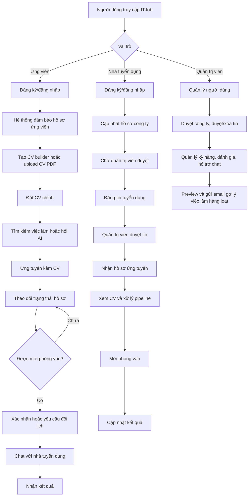

**Hình 2.1: Quy trình nghiệp vụ tổng quát của hệ thống ITJob**

### Bảng 2.1: Diễn Giải Quy Trình Hoạt Động Nghiệp Vụ

| STT | Hoạt động | Input Data | Output Data | End User |
|---:|---|---|---|---|
| 1 | Đăng ký/đăng nhập tài khoản | Email, mật khẩu hoặc Google token | Phiên đăng nhập, vai trò người dùng | Ứng viên, nhà tuyển dụng, quản trị viên |
| 2 | Tự tạo hồ sơ ứng viên khi đăng nhập Google | Tài khoản vai trò `ung_vien` | Bản ghi `UNGVIEN` | Ứng viên |
| 3 | Cập nhật hồ sơ công ty | Thông tin công ty, logo, website, địa chỉ | Hồ sơ nhà tuyển dụng | Nhà tuyển dụng |
| 4 | Duyệt hồ sơ công ty | Hồ sơ công ty, trạng thái duyệt | Công ty được duyệt hoặc từ chối | Quản trị viên |
| 5 | Tạo tin tuyển dụng | Tiêu đề, mô tả, yêu cầu, kỹ năng, hạn nộp | Tin tuyển dụng chờ duyệt | Nhà tuyển dụng |
| 6 | Duyệt/xóa tin tuyển dụng | Tin tuyển dụng, lý do xử lý | Tin được công khai, từ chối hoặc xóa | Quản trị viên |
| 7 | Tạo CV bằng builder | Thông tin cá nhân, học vấn, kinh nghiệm, kỹ năng | CV loại `builder` | Ứng viên |
| 8 | Upload CV PDF | File PDF, tiêu đề CV | CV loại `file_upload` | Ứng viên |
| 9 | Đặt CV chính | Mã hồ sơ năng lực | Một CV chính duy nhất | Ứng viên |
| 10 | Tìm kiếm việc làm | Từ khóa, kỹ năng, địa điểm, mức lương | Danh sách job phù hợp | Ứng viên, khách |
| 11 | Chatbot hỏi việc làm | Câu hỏi tự nhiên, bộ lọc | Câu trả lời dựa trên job trong DB | Ứng viên, khách |
| 12 | Ứng tuyển | Mã job, CV đã chọn, thư xin việc | Hồ sơ ứng tuyển | Ứng viên |
| 13 | Xử lý pipeline hồ sơ | Hồ sơ ứng tuyển, trạng thái mới, ghi chú | Lịch sử trạng thái, thông báo | Nhà tuyển dụng |
| 14 | Lên lịch phỏng vấn | Thời gian, hình thức, link họp/địa chỉ | Lịch phỏng vấn, thông báo | Nhà tuyển dụng |
| 15 | Xác nhận/đổi lịch | Mã lịch, ghi chú đổi lịch | Trạng thái lịch cập nhật | Ứng viên |
| 16 | Chat realtime | Người gửi, người nhận, nội dung | Tin nhắn, badge chưa đọc | Ứng viên, nhà tuyển dụng, admin |
| 17 | AI quét CV chính | CV chính, job đang mở | Điểm phù hợp, lý do, kỹ năng khớp/thiếu | Ứng viên, admin |
| 18 | Gửi email hàng loạt | Kết quả matching, SMTP config | Email job phù hợp | Quản trị viên |
| 19 | Nhận thông báo realtime | Sự kiện nghiệp vụ | Toast, badge, inbox thông báo | Tất cả vai trò |
| 20 | Đánh giá công ty | Điểm, nội dung, trạng thái ẩn danh | Đánh giá chờ duyệt | Ứng viên, admin |

## 2.1.3. Liệt Kê Người Dùng Và Yêu Cầu

| Người dùng/tác nhân | Yêu cầu chức năng | Yêu cầu phi chức năng |
|---|---|---|
| Khách truy cập | Xem trang chủ, tìm việc, xem công ty, hỏi chatbot AI, đăng ký/đăng nhập | Giao diện responsive, tìm kiếm nhanh, dữ liệu không bịa ngoài hệ thống |
| Ứng viên | Quản lý hồ sơ, tạo CV, upload PDF, đặt CV chính, ứng tuyển, theo dõi hồ sơ, lịch phỏng vấn, chat, thông báo, quét job phù hợp | Bảo mật CV, chỉ chat khi đủ điều kiện, mobile dễ dùng |
| Nhà tuyển dụng | Quản lý công ty, đăng tin, xem ứng viên, xử lý pipeline, mời phỏng vấn, chat admin/ứng viên, nhận thông báo | Workflow rõ, không quay lùi trạng thái sai nghiệp vụ, danh sách responsive |
| Quản trị viên | Quản lý người dùng, duyệt công ty, duyệt/xóa tin, quản lý kỹ năng, đánh giá, chat hỗ trợ, gửi email hàng loạt | Có xác nhận thao tác nguy hiểm, audit rõ, thống kê chính xác |
| Gemini API | Chấm điểm CV-job, diễn giải lý do, chatbot tìm việc | Chỉ dùng dữ liệu database; có fallback khi lỗi |
| SMTP Service | Gửi email job phù hợp | Lỗi cấu hình phải rõ ràng, không làm chết hệ thống |
| Socket.IO | Chat và thông báo realtime | Badge và toast cập nhật ngay, có polling dự phòng |

## 2.2. Phân Tích Thiết Kế Hệ Thống

## 2.2.1. Liệt Kê Actor Và Use Case

| Actor | Use case chính |
|---|---|
| Quản trị viên | Quản lý tài khoản, duyệt công ty, duyệt/xóa tin tuyển dụng, quản lý kỹ năng, duyệt đánh giá, chat hỗ trợ, gửi email gợi ý việc làm |
| Nhà tuyển dụng | Quản lý hồ sơ công ty, đăng tin, quản lý tin, xem hồ sơ ứng viên, xử lý pipeline, đặt lịch phỏng vấn, chat, xem thông báo |
| Ứng viên | Cập nhật hồ sơ, tạo/upload CV, đặt CV chính, tìm việc, ứng tuyển, theo dõi hồ sơ, xác nhận lịch, chat, xem thông báo, quét việc phù hợp |
| Khách | Xem job/công ty, hỏi chatbot, đăng ký/đăng nhập |
| Gemini API | Chấm điểm, sinh lý do matching, trả lời chatbot từ dữ liệu DB |
| SMTP | Gửi email gợi ý việc làm |
| Socket.IO | Đẩy realtime tin nhắn và thông báo |

## 2.2.2. Sơ Đồ Use Case

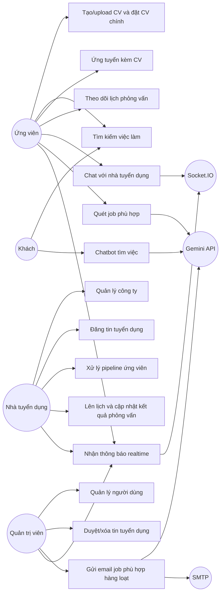

## 2.2.3. Kịch Bản Và Sơ Đồ Hoạt Động

### 2.2.3.1. Actor Quản Trị Viên

#### 2.2.3.1.1. Use Case Cập Nhật Tài Khoản Người Dùng

| Mục | Nội dung |
|---|---|
| Use-case name | Cập nhật tài khoản người dùng |
| Description | Quản trị viên tạo mới, chỉnh sửa, khóa hoặc xóa tài khoản người dùng trong hệ thống |
| Actors | Quản trị viên |
| Input | Quản trị viên đã đăng nhập; thông tin tài khoản cần xử lý |
| Output | Tài khoản được tạo/cập nhật/xóa/khóa và hệ thống hiển thị thông báo thành công |
| Basic flow | 1. Quản trị viên chọn “Quản lý người dùng”. 2. Nhấn “Tạo mới”. 3. Nhập email, họ tên, số điện thoại, vai trò, trạng thái. 4. Nhấn “Lưu”. 5. Hệ thống kiểm tra dữ liệu và lưu tài khoản. 6. Hệ thống hiển thị thông báo xử lý thành công. |
| Alternative flow | 2a. Quản trị viên chọn “Sửa” để cập nhật tài khoản. 2b. Quản trị viên chọn “Khóa” để tạm khóa tài khoản. 2c. Quản trị viên chọn “Xóa” và xác nhận để xóa tài khoản hợp lệ. |
| Exception flow | Email trùng, thiếu dữ liệu bắt buộc, tài khoản không tồn tại, không được xóa admin cuối cùng của hệ thống. |

#### 2.2.3.1.2. Use Case Duyệt/Xóa Tin Tuyển Dụng

| Mục | Nội dung |
|---|---|
| Use-case name | Duyệt và xóa tin tuyển dụng |
| Actors | Quản trị viên |
| Input | Danh sách tin tuyển dụng, trạng thái duyệt, lý do từ chối/xóa nếu có |
| Output | Tin được mở công khai, bị từ chối hoặc bị xóa khỏi hệ thống |
| Basic flow | 1. Admin mở “Tin tuyển dụng”. 2. Chọn một tin. 3. Xem chi tiết mô tả, yêu cầu, công ty, hạn nộp. 4. Chọn duyệt hoặc từ chối. 5. Hệ thống cập nhật trạng thái và thông báo cho nhà tuyển dụng. |
| Alternative flow | Admin chọn “Xóa”, xác nhận, hệ thống gọi API xóa và reload danh sách. |
| Exception flow | Tin không tồn tại, tin đã bị xóa, quyền admin không hợp lệ, backend từ chối do ràng buộc nghiệp vụ. |

#### 2.2.3.1.3. Use Case Gửi Email Gợi Ý Việc Làm Hàng Loạt

| Mục | Nội dung |
|---|---|
| Use-case name | Gửi email gợi ý việc làm hàng loạt |
| Actors | Quản trị viên, Gemini API, SMTP |
| Input | Danh sách ứng viên có email và CV chính, danh sách job đang mở |
| Output | Email chứa tối đa 5 job phù hợp nhất cho từng ứng viên |
| Basic flow | 1. Admin mở chức năng gửi email gợi ý. 2. Hệ thống preview số ứng viên hợp lệ, số bị bỏ qua và số job hợp lệ. 3. Admin xác nhận gửi. 4. Backend quét CV chính với job đang mở. 5. Gemini/DB matching tạo điểm và lý do. 6. SMTP gửi email. 7. Hệ thống ghi nhận kết quả gửi. |
| Exception flow | Thiếu SMTP, thiếu Gemini key, Gemini lỗi, ứng viên không có email, ứng viên không có CV chính, job hết hạn. |

### 2.2.3.2. Actor Nhà Tuyển Dụng

#### Use Case Xử Lý Pipeline Ứng Viên

| Mục | Nội dung |
|---|---|
| Use-case name | Xử lý pipeline hồ sơ ứng viên |
| Actors | Nhà tuyển dụng |
| Input | Hồ sơ ứng tuyển, trạng thái mới, ghi chú |
| Output | Trạng thái hồ sơ, lịch sử xử lý, thông báo cho ứng viên |
| Basic flow | 1. Nhà tuyển dụng mở “Ứng viên”. 2. Xem danh sách hồ sơ theo job. 3. Mở chi tiết CV đã nộp. 4. Chọn trạng thái hợp lệ tiếp theo. 5. Nhấn áp dụng. 6. Hệ thống ghi lịch sử và gửi thông báo. |
| Alternative flow | Nhà tuyển dụng mời phỏng vấn; hệ thống tạo lịch phỏng vấn và bật quyền chat 1-1. |
| Exception flow | Không được quay lại trạng thái cũ, không được chốt đạt/không đạt trước khi phỏng vấn hoàn tất, hồ sơ không thuộc công ty. |

### 2.2.3.3. Actor Ứng Viên

#### Use Case Tạo/Upload CV Và Ứng Tuyển

| Mục | Nội dung |
|---|---|
| Use-case name | Ứng tuyển kèm hồ sơ năng lực |
| Actors | Ứng viên |
| Input | Job, CV builder hoặc PDF upload, thư xin việc |
| Output | Hồ sơ ứng tuyển mới |
| Basic flow | 1. Ứng viên mở chi tiết việc làm. 2. Nhấn “Ứng tuyển”. 3. Chọn CV có sẵn hoặc upload CV PDF mới. 4. Nhập thư xin việc. 5. Nhấn “Gửi ứng tuyển”. 6. Hệ thống tạo hồ sơ ứng tuyển và gửi thông báo cho nhà tuyển dụng. |
| Exception flow | Chưa đăng nhập, chưa có hồ sơ ứng viên, job hết hạn, đã ứng tuyển job này, CV không hợp lệ. |

## Activity Diagram: Quy Trình Ứng Tuyển

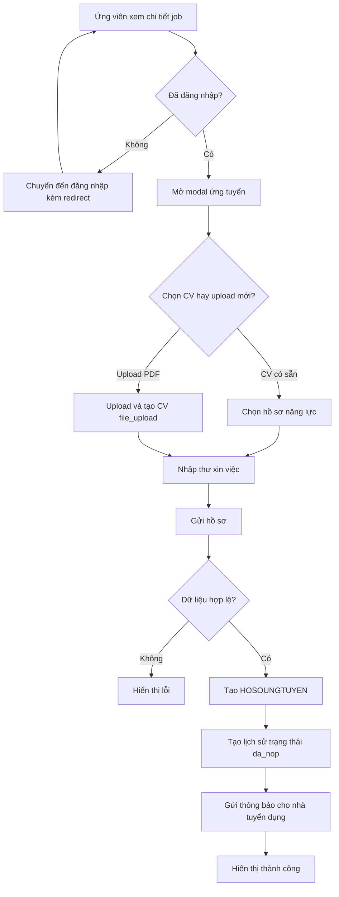

## Activity Diagram: Quy Trình Duyệt Và Phỏng Vấn

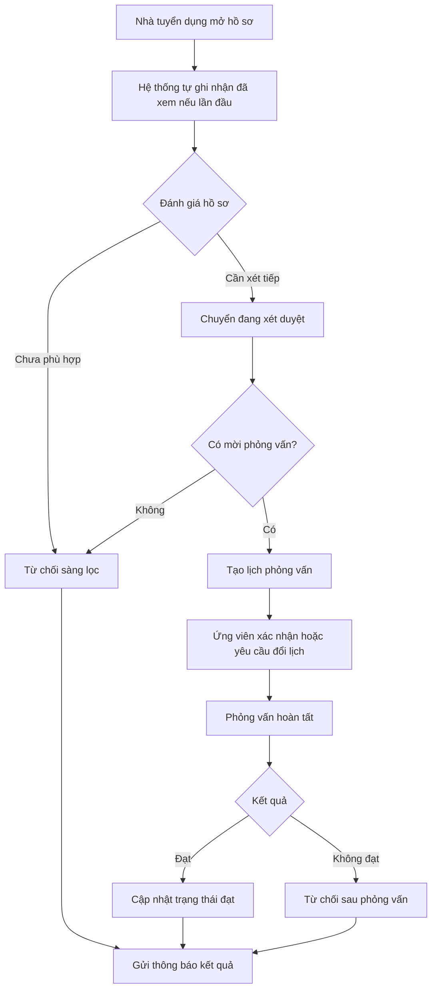

## Activity Diagram: AI Quét CV Chính

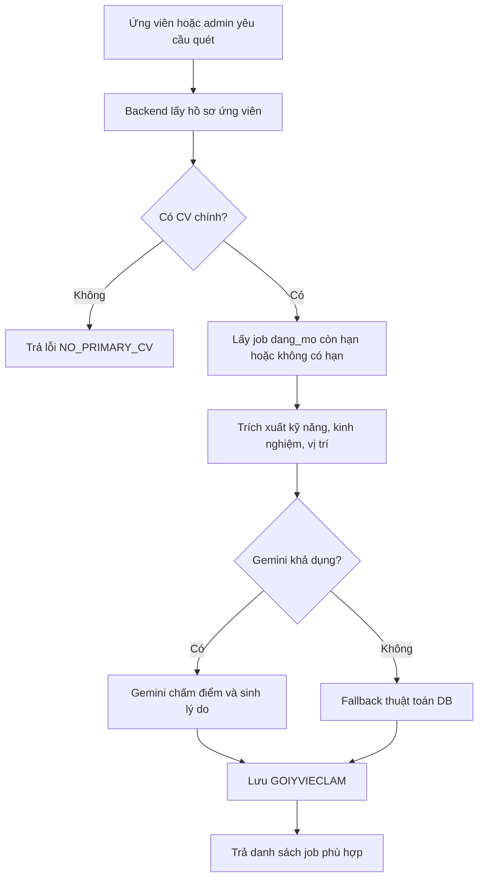

## 2.2.4. Sơ Đồ Class Mức 1

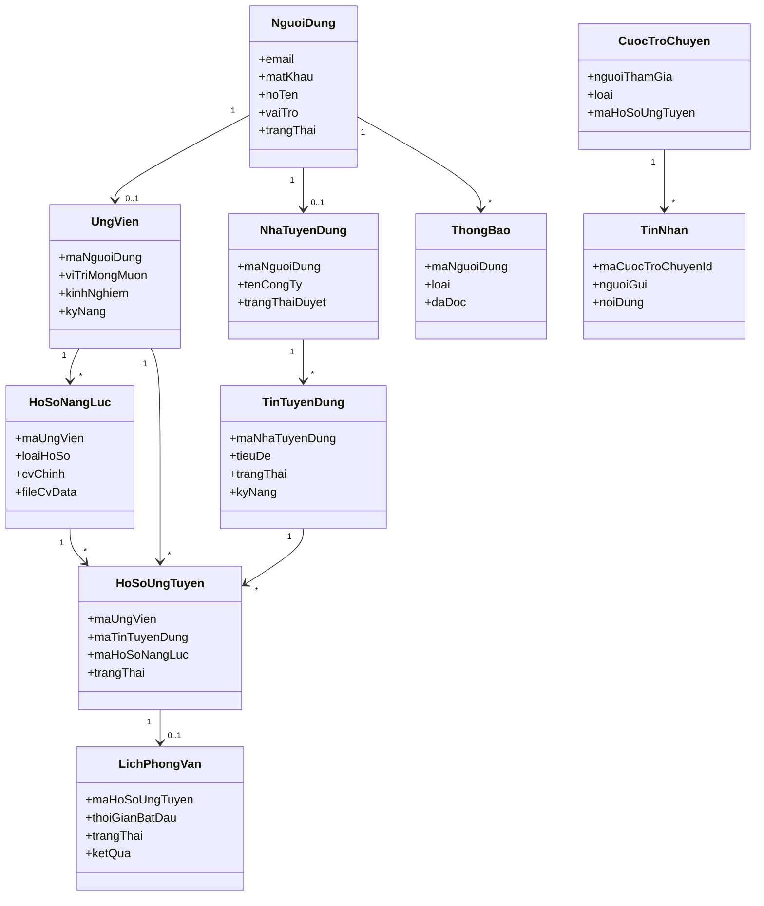

## 2.2.5. Thiết Kế ERD

ERD chi tiết được đặt tại tài liệu: `docs/so-do-co-so-du-lieu.md`.

Tóm tắt thiết kế dữ liệu:

- `NGUOIDUNG` là bảng trung tâm cho xác thực và phân quyền.
- `UNGVIEN` và `NHATUYENDUNG` là hồ sơ mở rộng 1-1 theo vai trò.
- `TINTUYENDUNG` thuộc `NHATUYENDUNG`; chỉ tin `dang_mo` và còn hạn mới tham gia matching/gợi ý.
- `HOSONANGLUC` tách rõ `builder` và `file_upload`; `cvChinh` là nguồn chính cho quick scan và ứng tuyển mặc định.
- `HOSOUNGTUYEN` là trung tâm workflow tuyển dụng, liên kết job, ứng viên, CV đã nộp, lịch sử, phỏng vấn, thông báo và chat.
- `GOIYVIECLAM` lưu kết quả matching AI/DB theo từng lần quét.
- `CUOCTROCHUYEN` và `TINNHAN` phục vụ chat realtime theo ngữ cảnh hồ sơ hoặc admin support.

## 2.2.6. Sơ Đồ Robustness

### Robustness: Ứng Tuyển

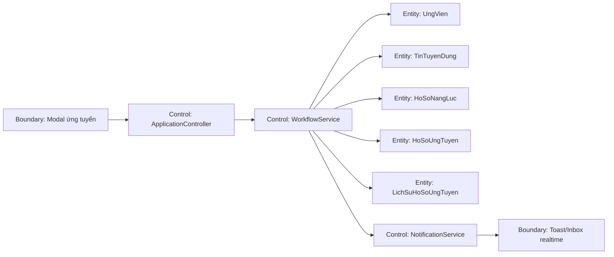

### Robustness: Chat Ứng Viên - Nhà Tuyển Dụng

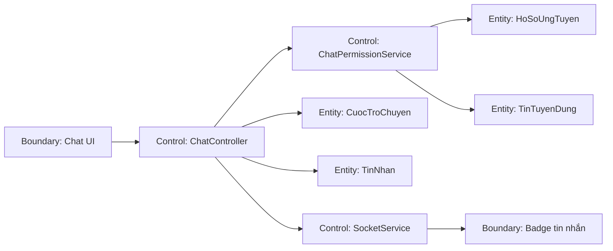

### Robustness: AI Matching

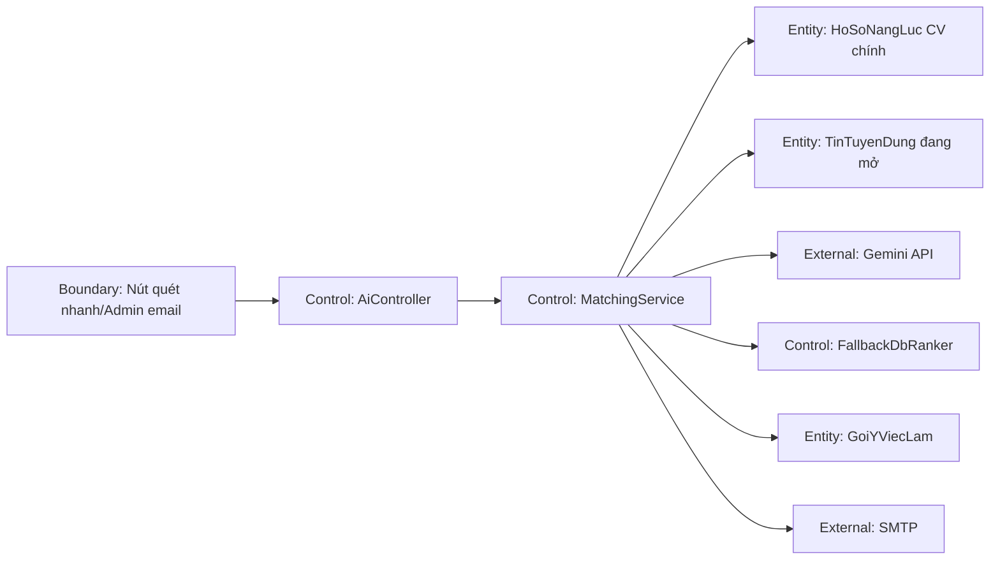

## 2.2.7. Sơ Đồ Tuần Tự

### Sequence: Ứng Tuyển Kèm CV

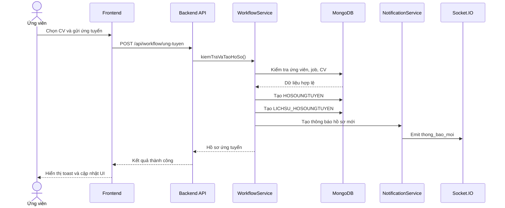

### Sequence: Chat Realtime

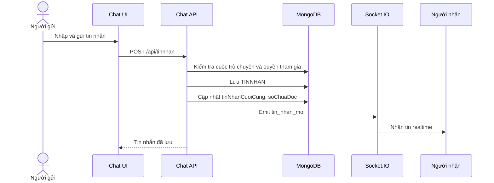

### Sequence: AI Quét CV Chính

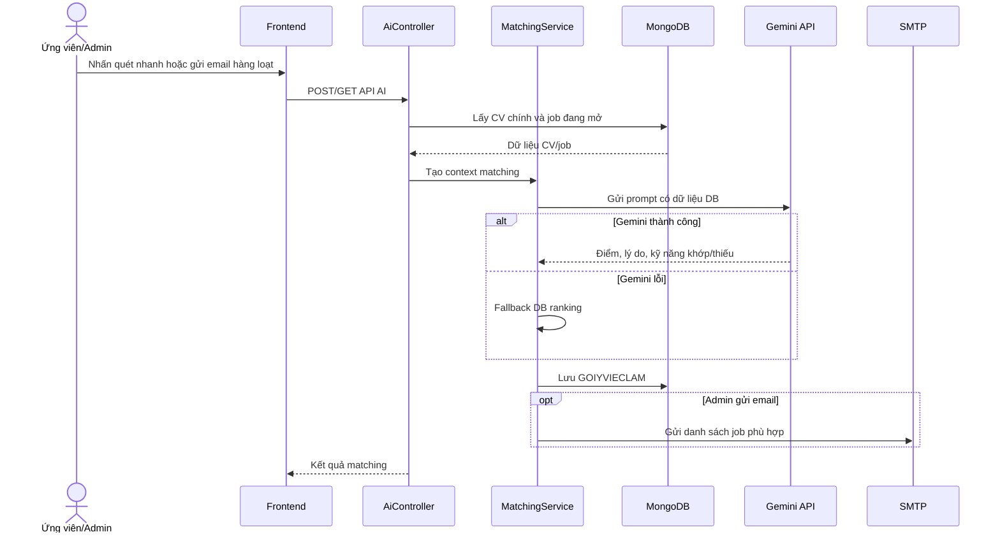

## 2.2.8. Sơ Đồ Class Mức 2

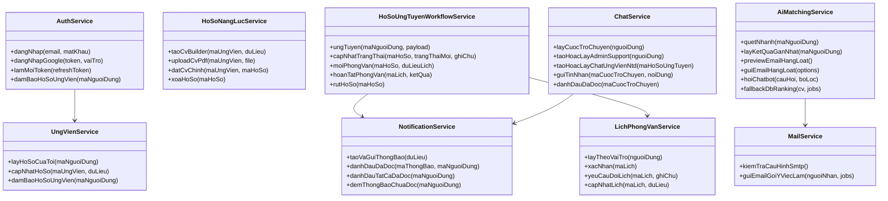

## Ghi Chú Kiểm Thử Thiết Kế

- Mỗi use case nghiệp vụ phải kiểm tra quyền theo vai trò ở backend, không chỉ ẩn nút trên frontend.
- CV upload PDF là hồ sơ loại `file_upload`, chỉ xem/tải/đặt làm CV chính; không đưa vào builder.
- Quick scan bắt buộc dùng `cvChinh = true`.
- Chat ứng viên - nhà tuyển dụng chỉ mở khi hồ sơ đạt trạng thái nghiệp vụ cho phép.
- Notification phải đồng bộ giữa socket, polling dự phòng và badge UI.
- Các bảng lớn trên mobile cần chuyển thành card list hoặc có vùng scroll riêng, tránh tràn nút và che chữ.

