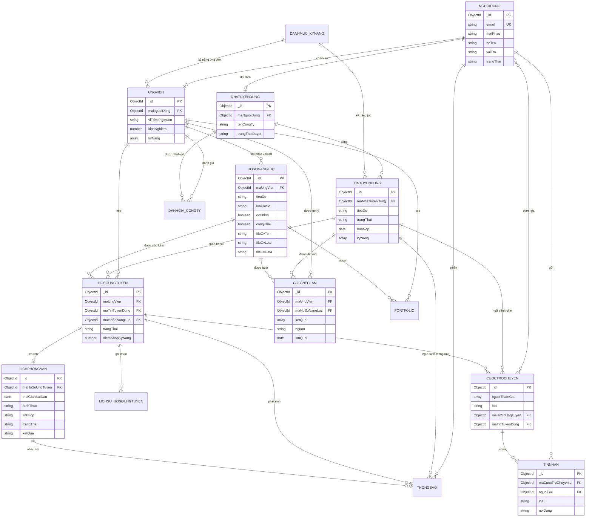

# Sơ Đồ Cơ Sở Dữ Liệu Hệ Thống ITJob

Tài liệu này mô tả cơ sở dữ liệu MongoDB của hệ thống ITJob theo cách trình bày gần với ERD quan hệ. Trong mã nguồn, mỗi collection dùng `_id:ObjectId` làm khóa chính; khi trình bày ERD, `_id` được xem như `id` của thực thể.

## 1. Danh Sách Thực Thể

| STT | Thực thể | Collection MongoDB | Vai trò |
|---:|---|---|---|
| 1 | NGUOIDUNG | `nguoi_dung` | Tài khoản đăng nhập trung tâm cho ứng viên, nhà tuyển dụng và quản trị viên |
| 2 | UNGVIEN | `ung_vien` | Hồ sơ mở rộng của tài khoản ứng viên |
| 3 | NHATUYENDUNG | `nha_tuyen_dung` | Hồ sơ công ty/nhà tuyển dụng |
| 4 | DANHMUC_KYNANG | `danh_muc_ky_nang` | Danh mục kỹ năng dùng chung |
| 5 | TINTUYENDUNG | `tin_tuyen_dung` | Tin tuyển dụng của nhà tuyển dụng |
| 6 | HOSONANGLUC | `ho_so_nang_luc` | CV builder hoặc file CV upload của ứng viên |
| 7 | HOSOUNGTUYEN | `ho_so_ung_tuyen` | Hồ sơ ứng tuyển vào một tin tuyển dụng |
| 8 | LICHSU_HOSOUNGTUYEN | `lich_su_ho_so_ung_tuyen` | Lịch sử thay đổi trạng thái hồ sơ ứng tuyển |
| 9 | LICHPHONGVAN | `lich_phong_van` | Lịch phỏng vấn gắn với hồ sơ ứng tuyển |
| 10 | THONGBAO | `thong_bao` | Thông báo realtime/polling cho người dùng |
| 11 | DANHGIA_CONGTY | `danh_gia_cong_ty` | Đánh giá công ty sau trải nghiệm tuyển dụng |
| 12 | GOIYVIECLAM | `goi_y_viec_lam` | Kết quả AI/DB matching CV chính với job đang mở |
| 13 | CUOCTROCHUYEN | `cuoc_tro_chuyen` | Cuộc trò chuyện admin support, ứng viên - nhà tuyển dụng, nhóm cộng đồng |
| 14 | TINNHAN | `tin_nhan` | Tin nhắn trong cuộc trò chuyện |
| 15 | PORTFOLIO | `portfolio` | Portfolio sinh từ hồ sơ năng lực |

## 2. Chi Tiết Thực Thể

### 2.1 NGUOIDUNG

| Trường | Kiểu | Ràng buộc | Mô tả |
|---|---|---|---|
| `_id` | ObjectId | PK | Mã người dùng |
| `email` | String | Unique, required | Email đăng nhập |
| `matKhau` | String | Required | Mật khẩu đã băm |
| `hoTen` | String | Required | Họ tên người dùng |
| `soDienThoai` | String | Optional | Số điện thoại |
| `vaiTro` | Enum | `ung_vien`, `nha_tuyen_dung`, `admin` | Vai trò tài khoản |
| `trangThai` | Enum | `hoat_dong`, `tam_khoa`, `bi_khoa` | Trạng thái tài khoản |
| `ngayTao` | Date | Auto | Ngày tạo |
| `ngayCapNhat` | Date | Auto | Ngày cập nhật |

### 2.2 UNGVIEN

| Trường | Kiểu | Ràng buộc | Mô tả |
|---|---|---|---|
| `_id` | ObjectId | PK | Mã hồ sơ ứng viên |
| `maNguoiDung` | ObjectId | FK, unique | Liên kết `NGUOIDUNG` |
| `ngaySinh` | Date | Optional | Ngày sinh |
| `gioiTinh` | Enum | `nam`, `nu`, `khac` | Giới tính |
| `diaChi` | String | Optional | Địa chỉ |
| `anhDaiDien` | String | Optional | Ảnh đại diện |
| `tomTat` | String | Optional | Tóm tắt cá nhân |
| `kinhNghiem` | Number | Default 0 | Số năm kinh nghiệm |
| `viTriMongMuon` | String | Optional | Vị trí mong muốn |
| `mucLuongMongMuon` | Number | Optional | Mức lương mong muốn |
| `kyNang[].maKyNang` | ObjectId | FK | Kỹ năng của ứng viên |
| `kyNang[].mucDo` | Number | 1-5 | Mức thành thạo |
| `portfolio[]` | Embedded | Optional | Dự án cá nhân nhanh |
| `ngayTao`, `ngayCapNhat` | Date | Auto | Audit thời gian |

### 2.3 NHATUYENDUNG

| Trường | Kiểu | Ràng buộc | Mô tả |
|---|---|---|---|
| `_id` | ObjectId | PK | Mã nhà tuyển dụng |
| `maNguoiDung` | ObjectId | FK, unique | Tài khoản đại diện |
| `tenCongTy` | String | Required | Tên công ty |
| `maSoThue` | String | Optional | Mã số thuế |
| `moTa` | String | Optional | Mô tả công ty |
| `diaChi` | String | Default `Da Nang` | Địa chỉ |
| `website` | String | Optional | Website |
| `logo` | String | Optional | Logo |
| `quyMo` | Number | Optional | Quy mô nhân sự |
| `nganh` | String | Default | Ngành nghề |
| `trangThaiDuyet` | Enum | `cho_duyet`, `da_duyet`, `tu_choi`, `bi_khoa` | Trạng thái duyệt |
| `lyDoTuChoi` | String | Optional | Lý do bị từ chối |
| `ngayDuyet` | Date | Optional | Thời điểm duyệt |

### 2.4 DANHMUC_KYNANG

| Trường | Kiểu | Ràng buộc | Mô tả |
|---|---|---|---|
| `_id` | ObjectId | PK | Mã kỹ năng |
| `tenKyNang` | String | Unique, required | Tên kỹ năng |
| `loaiKyNang` | String | Required | Nhóm kỹ năng |

### 2.5 TINTUYENDUNG

| Trường | Kiểu | Ràng buộc | Mô tả |
|---|---|---|---|
| `_id` | ObjectId | PK | Mã tin tuyển dụng |
| `maNhaTuyenDung` | ObjectId | FK | Chủ tin |
| `tieuDe` | String | Required | Tiêu đề |
| `yeuCauKinhNghiem` | String | Optional | Yêu cầu kinh nghiệm |
| `diaChi` | String | Default | Địa điểm làm việc |
| `luongMin`, `luongMax` | Number | Optional | Khoảng lương |
| `loaiHinh` | Enum | `toan_thoi_gian`, `ban_thoi_gian`, `thuc_tap`, `tu_xa`, `hybrid` | Loại hình làm việc |
| `capBac` | Enum | `intern`, `fresher`, `junior`, `middle`, `senior`, `lead` | Cấp bậc |
| `anhDaiDien` | String | Optional | Ảnh/banner tin |
| `hanNop` | Date | Optional | Hạn nộp hồ sơ |
| `soLuong` | Number | Default 1 | Số lượng tuyển |
| `moTa` | String | Required | Mô tả công việc |
| `yeuCau` | String | Required | Yêu cầu ứng viên |
| `quyenLoi` | String | Optional | Quyền lợi |
| `luotXem` | Number | Default 0 | Số lượt xem |
| `trangThai` | Enum | `nhap`, `cho_duyet`, `dang_mo`, `tam_dong`, `het_han`, `tu_choi` | Trạng thái tin |
| `ngayDang` | Date | Optional | Ngày đăng |
| `kyNang[].maKyNang` | ObjectId | FK | Kỹ năng yêu cầu |
| `kyNang[].batBuoc` | Boolean | Default true | Kỹ năng bắt buộc |

### 2.6 HOSONANGLUC

| Trường | Kiểu | Ràng buộc | Mô tả |
|---|---|---|---|
| `_id` | ObjectId | PK | Mã hồ sơ năng lực |
| `maUngVien` | ObjectId | FK | Chủ CV |
| `tieuDe` | String | Required | Tên CV |
| `loaiHoSo` | Enum | `builder`, `file_upload` | CV tạo trong hệ thống hoặc file upload |
| `cvChinh` | Boolean | Default false | CV chính dùng cho ứng tuyển/matching |
| `congKhai` | Boolean | Default true | Cho phép hiển thị công khai |
| `fileCvTen` | String | Optional | Tên file CV upload |
| `fileCvLoai` | String | Optional | MIME type file |
| `fileCvData` | String | Optional | Dữ liệu file/base64 hoặc đường dẫn lưu trữ |
| `hoTenHienThi`, `chucDanh`, `emailLienHe`, `soDienThoai` | String | Optional | Thông tin hiển thị trên CV |
| `facebook`, `github`, `portfolioUrl`, `diaDiem` | String | Optional | Liên kết và địa điểm |
| `tomTatKinhNghiem[]` | String[] | Optional | Tóm tắt kinh nghiệm |
| `kyNangMem[]` | String[] | Optional | Kỹ năng mềm |
| `kyNangLapTrinh[]` | Embedded | Optional | Nhóm kỹ năng lập trình |
| `hocVan[]`, `kinhNghiemLam[]`, `chungChi[]`, `duAn[]` | Embedded | Optional | Mục thông tin CV |
| `duAnChiTiet[]` | Embedded | Optional | Dự án chi tiết |
| `baiVietKyThuat[]` | Embedded | Optional | Bài viết kỹ thuật |
| `anhDaiDien` | String | Optional | Ảnh dùng trong CV |
| `templateCv`, `mauChinh`, `mauPhu`, `font` | String | Optional | Cấu hình giao diện CV |
| `markdownGoc`, `ghiChuAi` | String | Optional | Nội dung nguồn và ghi chú AI |

### 2.7 HOSOUNGTUYEN

| Trường | Kiểu | Ràng buộc | Mô tả |
|---|---|---|---|
| `_id` | ObjectId | PK | Mã hồ sơ ứng tuyển |
| `maUngVien` | ObjectId | FK | Ứng viên ứng tuyển |
| `maTinTuyenDung` | ObjectId | FK | Tin được ứng tuyển |
| `maHoSoNangLuc` | ObjectId | FK | CV đã nộp kèm |
| `thuXinViec` | String | Optional | Thư xin việc |
| `diemKhopKyNang` | Number | Default 0 | Điểm khớp kỹ năng |
| `trangThai` | Enum | `da_nop`, `da_xem`, `dang_xet_duyet`, `moi_phong_van`, `dat`, `tu_choi`, `da_rut` | Trạng thái pipeline |
| `ngayNop` | Date | Default now | Ngày nộp |

### 2.8 LICHSU_HOSOUNGTUYEN

| Trường | Kiểu | Ràng buộc | Mô tả |
|---|---|---|---|
| `_id` | ObjectId | PK | Mã lịch sử |
| `maHoSoUngTuyen` | ObjectId | FK | Hồ sơ ứng tuyển |
| `trangThaiCu` | Enum | Optional | Trạng thái trước |
| `trangThaiMoi` | Enum | Required | Trạng thái sau |
| `ghiChu` | String | Optional | Ghi chú xử lý/lý do từ chối |
| `maNguoiDung` | ObjectId | FK | Người thực hiện |
| `thoiGian` | Date | Default now | Thời điểm chuyển trạng thái |

### 2.9 LICHPHONGVAN

| Trường | Kiểu | Ràng buộc | Mô tả |
|---|---|---|---|
| `_id` | ObjectId | PK | Mã lịch phỏng vấn |
| `maHoSoUngTuyen` | ObjectId | FK, unique | Hồ sơ được phỏng vấn |
| `thoiGianBatDau`, `thoiGianKetThuc` | Date | Required/optional | Thời gian phỏng vấn |
| `diaChi` | String | Optional | Địa chỉ phỏng vấn |
| `hinhThuc` | Enum | `online`, `offline` | Hình thức |
| `linkHop` | String | Optional | Link họp online |
| `ghiChu` | String | Optional | Ghi chú |
| `trangThai` | Enum | `da_len_lich`, `da_xac_nhan`, `doi_lich`, `hoan_thanh`, `da_huy` | Trạng thái lịch |
| `ketQua` | Enum | `cho_ket_qua`, `dat`, `khong_dat` | Kết quả phỏng vấn |

### 2.10 THONGBAO

| Trường | Kiểu | Ràng buộc | Mô tả |
|---|---|---|---|
| `_id` | ObjectId | PK | Mã thông báo |
| `maNguoiDung` | ObjectId | FK | Người nhận |
| `loai` | Enum | `he_thong`, `ho_so_ung_tuyen`, `lich_phong_van`, `tin_tuyen_dung`, `cong_ty`, `tin_nhan`, `ket_qua_phong_van` | Loại thông báo |
| `tieuDe`, `noiDung` | String | Required | Nội dung hiển thị |
| `lienKet` | String | Optional | Link xử lý |
| `maHoSoUngTuyen`, `maLichPhongVan`, `maTinTuyenDung` | ObjectId | FK optional | Ngữ cảnh nghiệp vụ |
| `daDoc` | Boolean | Default false | Đã đọc |
| `daGui` | Boolean | Default false | Đã gửi qua kênh phụ |
| `mucDoUuTien` | Enum | `thap`, `trung_binh`, `cao`, `khan_cap` | Mức ưu tiên |
| `hanhDong[]` | Embedded | Optional | Nút thao tác nhanh |
| `icon`, `mauSac` | String | Optional | Metadata UI |
| `hetHan` | Date | Optional | Hết hạn tự xóa |

### 2.11 DANHGIA_CONGTY

| Trường | Kiểu | Ràng buộc | Mô tả |
|---|---|---|---|
| `_id` | ObjectId | PK | Mã đánh giá |
| `maUngVien` | ObjectId | FK | Ứng viên đánh giá |
| `maNhaTuyenDung` | ObjectId | FK | Công ty được đánh giá |
| `diem` | Number | 1-5 | Điểm đánh giá |
| `noiDung` | String | Required | Nội dung |
| `anDanh` | Boolean | Default false | Đánh giá ẩn danh |
| `daDuyet` | Boolean | Default false | Trạng thái duyệt |

### 2.12 GOIYVIECLAM

| Trường | Kiểu | Ràng buộc | Mô tả |
|---|---|---|---|
| `_id` | ObjectId | PK | Mã lần gợi ý |
| `maUngVien` | ObjectId | FK | Ứng viên được quét |
| `maHoSoNangLuc` | ObjectId | FK | CV chính dùng để quét |
| `ketQua[].maTinTuyenDung` | ObjectId | FK | Job phù hợp |
| `ketQua[].diem` | Number | Default 0 | Điểm phù hợp |
| `ketQua[].lyDo` | String | Optional | Lý do AI/DB chấm điểm |
| `ketQua[].kyNangKhop` | String[] | Optional | Kỹ năng khớp |
| `ketQua[].kyNangThieu` | String[] | Optional | Kỹ năng thiếu |
| `trangThai` | Enum | `dang_chay`, `hoan_thanh`, `loi` | Trạng thái xử lý |
| `loi` | String | Optional | Lỗi khi quét |
| `nguon` | String | Default `gemini` | Nguồn chấm điểm |
| `lanQuet` | Date | Default now | Thời điểm quét |

### 2.13 CUOCTROCHUYEN

| Trường | Kiểu | Ràng buộc | Mô tả |
|---|---|---|---|
| `_id` | ObjectId | PK | Mã cuộc trò chuyện |
| `nguoiThamGia[]` | ObjectId[] | FK | Danh sách người tham gia |
| `loai` | Enum | `ung_vien_nha_tuyen_dung`, `admin_support`, `nhom_cong_dong` | Loại chat |
| `tenNhom`, `moTaNhom`, `anhNhom` | String | Optional | Thông tin nhóm |
| `quanTriNhom[]` | ObjectId[] | FK | Admin nhóm cộng đồng |
| `maHoSoUngTuyen` | ObjectId | FK optional | Ngữ cảnh ứng tuyển |
| `maTinTuyenDung` | ObjectId | FK optional | Ngữ cảnh tin tuyển dụng |
| `tinNhanCuoiCung` | Embedded | Optional | Preview tin nhắn cuối |
| `soChuaDoc` | Map<userId, number> | Default `{}` | Số tin chưa đọc theo người dùng |
| `daLuuTru` | Boolean | Default false | Trạng thái lưu trữ |
| `thoiGianLuuTru` | Date | Optional | Thời điểm lưu trữ |

### 2.14 TINNHAN

| Trường | Kiểu | Ràng buộc | Mô tả |
|---|---|---|---|
| `_id` | ObjectId | PK | Mã tin nhắn |
| `maCuocTroChuyenId` | ObjectId | FK | Cuộc trò chuyện |
| `nguoiGui` | ObjectId | FK | Người gửi |
| `loai` | Enum | `text`, `file`, `image`, `system` | Loại tin |
| `noiDung` | String | Required | Nội dung |
| `tepDinhKem[]` | Embedded | Optional | File đính kèm |
| `traloiTinNhan` | ObjectId | FK optional | Tin nhắn được trả lời |
| `daDuocDocBoi[]` | Embedded | Optional | Read receipt |
| `phanUng[]` | Embedded | Optional | Reaction |
| `daXoa`, `daChinhSua` | Boolean | Default false | Trạng thái tin |
| `thoiGianChinhSua` | Date | Optional | Thời điểm sửa |

### 2.15 PORTFOLIO

| Trường | Kiểu | Ràng buộc | Mô tả |
|---|---|---|---|
| `_id` | ObjectId | PK | Mã portfolio |
| `maUngVien` | ObjectId | FK | Chủ portfolio |
| `maHoSoNangLuc` | ObjectId | FK | CV nguồn |
| `tieuDe` | String | Required | Tiêu đề |
| `markdown` | String | Default empty | Nội dung markdown |
| `theme` | Enum | `professional`, `modern`, `creative` | Giao diện |
| `mauChinh`, `mauPhu`, `font` | String | Optional | Cấu hình hiển thị |
| `trangThai` | Enum | `nhap`, `da_tao` | Trạng thái |
| `htmlLanCuoi` | String | Optional | HTML render gần nhất |

## 3. Quan Hệ Chính

| Quan hệ | Kiểu | Diễn giải |
|---|---|---|
| NGUOIDUNG - UNGVIEN | 1 - 0..1 | Một tài khoản ứng viên có một hồ sơ ứng viên |
| NGUOIDUNG - NHATUYENDUNG | 1 - 0..1 | Một tài khoản nhà tuyển dụng có một hồ sơ công ty |
| NHATUYENDUNG - TINTUYENDUNG | 1 - n | Một công ty đăng nhiều tin tuyển dụng |
| UNGVIEN - HOSONANGLUC | 1 - n | Một ứng viên có nhiều CV; chỉ một CV chính |
| UNGVIEN - HOSOUNGTUYEN | 1 - n | Một ứng viên ứng tuyển nhiều job |
| TINTUYENDUNG - HOSOUNGTUYEN | 1 - n | Một tin nhận nhiều hồ sơ |
| HOSONANGLUC - HOSOUNGTUYEN | 1 - n | Một CV có thể dùng nộp nhiều hồ sơ |
| HOSOUNGTUYEN - LICHSU_HOSOUNGTUYEN | 1 - n | Một hồ sơ có nhiều mốc lịch sử |
| HOSOUNGTUYEN - LICHPHONGVAN | 1 - 0..1 | Một hồ sơ có tối đa một lịch phỏng vấn hiện hành |
| NGUOIDUNG - THONGBAO | 1 - n | Một người dùng nhận nhiều thông báo |
| UNGVIEN - GOIYVIECLAM | 1 - n | Một ứng viên có nhiều lần quét gợi ý |
| CUOCTROCHUYEN - TINNHAN | 1 - n | Một cuộc trò chuyện có nhiều tin nhắn |
| NGUOIDUNG - CUOCTROCHUYEN | n - n | Người dùng tham gia nhiều cuộc trò chuyện |

## 4. Mermaid ERD

