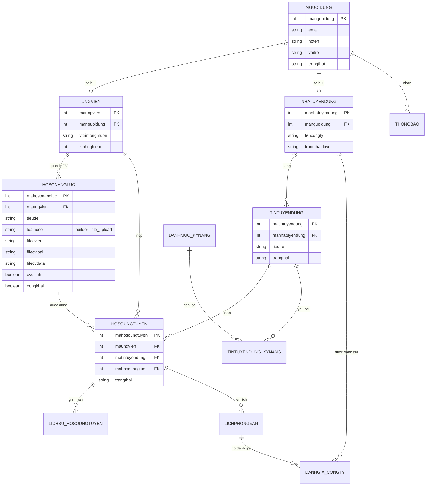

# So do co so du lieu tuyen dung CNTT

Tai lieu nay luu lai thiet ke database goc tu so do ERD. Backend hien tai dung MongoDB/Mongoose, nen khi trien khai:

- Khoa chinh `INT` trong so do quan he duoc map sang `_id: ObjectId`.
- Cac cot khoa ngoai `ma... INT` duoc map sang `ObjectId` va `ref` den model tuong ung.
- Cac cot `ngaytao`, `ngaycapnhat` duoc map bang `timestamps`.
- Cac cot `TINYINT` nen duoc chuan hoa thanh enum ro nghia trong code.

## NGUOIDUNG

| Khoa | Cot | Kieu |
| --- | --- | --- |
| PK | manguoidung | INT |
|  | email | VARCHAR(100) |
|  | matkhau | VARCHAR(255) |
|  | hoten | NVARCHAR(50) |
|  | sodienthoai | VARCHAR(15) |
|  | vaitro | TINYINT |
|  | trangthai | TINYINT |
|  | ngaytao | DATETIME |
|  | ngaycapnhat | DATETIME |

Ghi chu vai tro de trien khai seed:

| Gia tri de xuat | Vai tro |
| --- | --- |
| admin | Quan tri vien |
| ung_vien | Ung vien |
| nha_tuyen_dung | Nha tuyen dung |

## UNGVIEN

| Khoa | Cot | Kieu |
| --- | --- | --- |
| PK | maungvien | INT |
| FK | manguoidung | INT |
|  | ngaysinh | DATE |
|  | gioitinh | TINYINT |
|  | diachi | NVARCHAR(255) |
|  | tomtat | NVARCHAR(1000) |
|  | kinhnghiem | TINYINT |
|  | vitrimongmuon | NVARCHAR(200) |
|  | mucluongmong | INT |
|  | ngaycapnhat | DATETIME |

Quan he:

- `UNGVIEN.manguoidung` -> `NGUOIDUNG.manguoidung`

## NHATUYENDUNG

| Khoa | Cot | Kieu |
| --- | --- | --- |
| PK | manhatuyendung | INT |
| FK | manguoidung | INT |
|  | tencongty | NVARCHAR(200) |
|  | mota | NVARCHAR(MAX) |
|  | diachi | NVARCHAR(255) |
|  | website | VARCHAR(255) |
|  | logo | VARCHAR(255) |
|  | quymo | INT |
|  | nganh | NVARCHAR(100) |
|  | trangthaiduyet | TINYINT |
|  | lydotuchoi | NVARCHAR(500) |
|  | ngayduyet | DATETIME |
|  | ngaycapnhat | DATETIME |

Quan he:

- `NHATUYENDUNG.manguoidung` -> `NGUOIDUNG.manguoidung`

## DANHMUC_KYNANG

| Khoa | Cot | Kieu |
| --- | --- | --- |
| PK | makynang | INT |
|  | tenkynang | NVARCHAR(100) |
|  | loaikynang | NVARCHAR(50) |

## UNGVIEN_KYNANG

| Khoa | Cot | Kieu |
| --- | --- | --- |
| PK | id | INT |
| FK | maungvien | INT |
| FK | makynang | INT |
|  | mucdo | TINYINT |

Quan he:

- `UNGVIEN_KYNANG.maungvien` -> `UNGVIEN.maungvien`
- `UNGVIEN_KYNANG.makynang` -> `DANHMUC_KYNANG.makynang`

## TINTUYENDUNG

| Khoa | Cot | Kieu |
| --- | --- | --- |
| PK | matintuyendung | INT |
| FK | manhatuyendung | INT |
|  | yeucaukinhnghiem | NVARCHAR(MAX) |
|  | diachi | NVARCHAR(200) |
|  | luongmin | INT |
|  | luongmax | INT |
|  | loaihinh | TINYINT |
|  | capbac | TINYINT |
|  | hannop | DATE |
|  | luotxem | INT |
|  | trangthai | TINYINT |
|  | ngaydang | DATETIME |
|  | ngaycapnhat | DATETIME |

Quan he:

- `TINTUYENDUNG.manhatuyendung` -> `NHATUYENDUNG.manhatuyendung`

## TINTUYENDUNG_KYNANG

| Khoa | Cot | Kieu |
| --- | --- | --- |
| PK | id | INT |
| FK | matintuyendung | INT |
| FK | makynang | INT |
|  | batbuoc | BIT |

Quan he:

- `TINTUYENDUNG_KYNANG.matintuyendung` -> `TINTUYENDUNG.matintuyendung`
- `TINTUYENDUNG_KYNANG.makynang` -> `DANHMUC_KYNANG.makynang`

## HOSONANGLUC

| Khoa | Cot | Kieu |
| --- | --- | --- |
| PK | mahosonangluc | INT |
| FK | maungvien | INT |
|  | tieude | NVARCHAR(200) |
|  | hocvan | NVARCHAR(MAX) |
|  | kinhnghiemlam | NVARCHAR(MAX) |
|  | chungchi | NVARCHAR(1000) |
|  | duan | NVARCHAR(MAX) |
|  | loaihoso | VARCHAR(30) |
|  | filecvten | NVARCHAR(255) |
|  | filecvloai | VARCHAR(100) |
|  | filecvdata | VARCHAR(500) |
|  | cvchinh | BIT |
|  | congkhai | BIT |
|  | ngaytao | DATETIME |
|  | ngaycapnhat | DATETIME |

Quan he:

- `HOSONANGLUC.maungvien` -> `UNGVIEN.maungvien`

## HOSOUNGTUYEN

| Khoa | Cot | Kieu |
| --- | --- | --- |
| PK | mahosoungtuyen | INT |
| FK | maungvien | INT |
| FK | matintuyendung | INT |
| FK | mahosonangluc | INT |
|  | thuxinviec | NVARCHAR(MAX) |
|  | diemkhopkynang | TINYINT |
|  | trangthai | TINYINT |
|  | ngaynop | DATETIME |
|  | ngaycapnhat | DATETIME |

Quan he:

- `HOSOUNGTUYEN.maungvien` -> `UNGVIEN.maungvien`
- `HOSOUNGTUYEN.matintuyendung` -> `TINTUYENDUNG.matintuyendung`
- `HOSOUNGTUYEN.mahosonangluc` -> `HOSONANGLUC.mahosonangluc`

## LICHSU_HOSOUNGTUYEN

| Khoa | Cot | Kieu |
| --- | --- | --- |
| PK | malichsu | INT |
| FK | mahosoungtuyen | INT |
|  | trangthaicu | TINYINT |
|  | trangthaimoi | TINYINT |
|  | ghichu | NVARCHAR(500) |
| FK | manguoidung | INT |
|  | thoigian | DATETIME |

Quan he:

- `LICHSU_HOSOUNGTUYEN.mahosoungtuyen` -> `HOSOUNGTUYEN.mahosoungtuyen`
- `LICHSU_HOSOUNGTUYEN.manguoidung` -> `NGUOIDUNG.manguoidung`

## LICHPHONGVAN

| Khoa | Cot | Kieu |
| --- | --- | --- |
| PK | malichpv | INT |
| FK | mahosoungtuyen | INT |
|  | thoigianbatdau | DATETIME |
|  | thoigianketthuc | DATETIME |
|  | diachi | NVARCHAR(255) |
|  | hinhthuc | TINYINT |
|  | ghichu | NVARCHAR(500) |
|  | trangthai | TINYINT |
|  | ketqua | TINYINT |
|  | ngaytao | DATETIME |

Quan he:

- `LICHPHONGVAN.mahosoungtuyen` -> `HOSOUNGTUYEN.mahosoungtuyen`

## THONGBAO

| Khoa | Cot | Kieu |
| --- | --- | --- |
| PK | mathongbao | INT |
| FK | manguoidung | INT |
|  | loai | TINYINT |
|  | tieude | NVARCHAR(200) |
|  | noidung | NVARCHAR(500) |
|  | lienket | VARCHAR(255) |
| FK | mahosoungtuyen | INT |
| FK | malichpv | INT |
|  | dadoc | BIT |
|  | ngaytao | DATETIME |

Quan he:

- `THONGBAO.manguoidung` -> `NGUOIDUNG.manguoidung`
- `THONGBAO.mahosoungtuyen` -> `HOSOUNGTUYEN.mahosoungtuyen`
- `THONGBAO.malichpv` -> `LICHPHONGVAN.malichpv`

## DANHGIA_CONGTY

| Khoa | Cot | Kieu |
| --- | --- | --- |
| PK | madanhgia | INT |
| FK | maungvien | INT |
| FK | manhatuyendung | INT |
| FK | malichpv | INT |
|  | diem | TINYINT |
|  | noidung | NVARCHAR(1000) |
|  | ngaytao | DATETIME |

Quan he:

- `DANHGIA_CONGTY.maungvien` -> `UNGVIEN.maungvien`
- `DANHGIA_CONGTY.manhatuyendung` -> `NHATUYENDUNG.manhatuyendung`
- `DANHGIA_CONGTY.malichpv` -> `LICHPHONGVAN.malichpv`

## Tong quan quan he chinh

- `NGUOIDUNG` la bang tai khoan trung tam cho 3 vai tro: admin, ung vien, nha tuyen dung.
- `UNGVIEN` va `NHATUYENDUNG` la ho so mo rong theo vai tro cua `NGUOIDUNG`.
- `NHATUYENDUNG` dang nhieu `TINTUYENDUNG`.
- `UNGVIEN` co nhieu `HOSONANGLUC` va nop `HOSOUNGTUYEN` vao `TINTUYENDUNG`.
- `HOSOUNGTUYEN` la trung tam cua quy trinh tuyen dung, lien ket den lich su trang thai, lich phong van va thong bao.
- `DANHMUC_KYNANG` duoc dung chung cho ky nang ung vien va ky nang bat buoc cua tin tuyen dung.
- `DANHGIA_CONGTY` gan danh gia cua ung vien voi nha tuyen dung va lich phong van lien quan.

## So do ERD cap nhat

